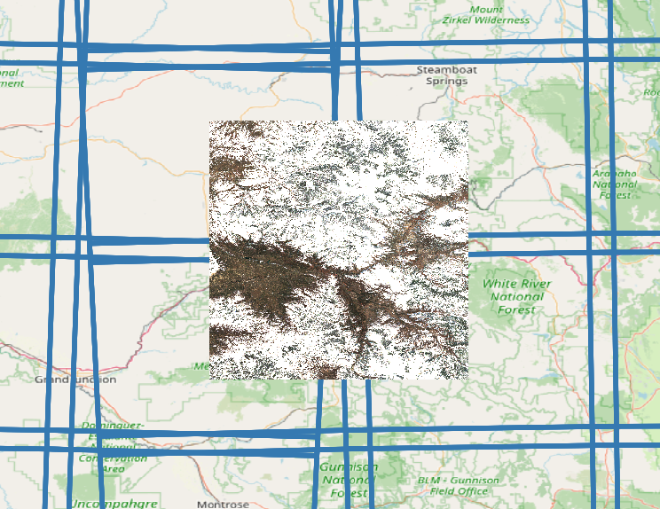
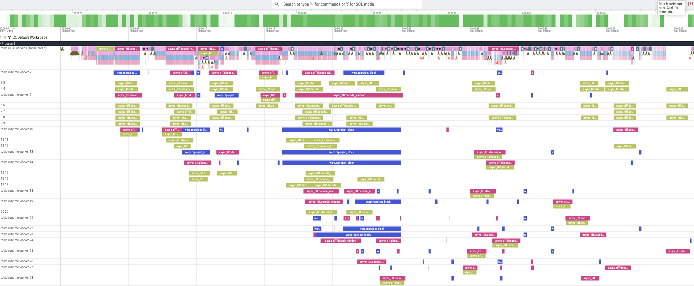

# mosaic-index (Python)

Python bindings for the Rust `mosaic-index` crate.

## Local development

```bash
cd python
uv sync --group dev
maturin develop
```

## Quick start
```bash
uv sync --group dev
maturin develop
python example.py
```

Take a look at `example.py` for a full end-to-end example demonstrating reprojection and resampling
from multiple tiles if differenent CRS to a target grid as visualized below:




## Profiling
Use Rust tracing to get logs and a Perfetto-compatible trace file.

### Enable logs and trace output

```bash
cd python
RUST_LOG="mosaic=trace,mosaic_index=trace,async_tiff=trace" \
MOSAIC_PERFETTO_TRACE="/tmp/mosaic-trace.json" \
python example.py
```




### What these env vars do

- `RUST_LOG`: Controls Rust log verbosity (`info`, `debug`, `trace`) and per-target filters.
  Recommended for profiling:
  `mosaic=trace,mosaic_index=trace,async_tiff=trace`
- `MOSAIC_PERFETTO_TRACE`: Output path for trace events to load in Perfetto.
- If `MOSAIC_PERFETTO_TRACE` is set and `RUST_LOG` is not set, the library now defaults to:
  `mosaic=trace,mosaic_index=trace,async_tiff=trace,info`
  so Perfetto includes span-level timing by default.

### Programmatic API

Use the context manager to auto-flush and finalize traces:

```python
from mosaic_index import TracingSession

with TracingSession(
    rust_log="mosaic=trace,mosaic_index=trace,async_tiff=trace",
    perfetto_path="/tmp/mosaic-trace.json",
):
    # ... run build_mosaic/build_mosaic_async ...
    pass
```

Notes:
- This handles `init_tracing()`, `flush_tracing()`, and `shutdown_tracing()` for you.
- Keep manual functions for advanced cases, but context manager is the default path.
- Perfetto must be enabled on the first tracing init in a process. If you reuse an interpreter
  (notebook/debug console), restart it before enabling `MOSAIC_PERFETTO_TRACE`.

### Open in Perfetto

Open `/tmp/mosaic-trace.json` in https://ui.perfetto.dev using **Open trace file**.
